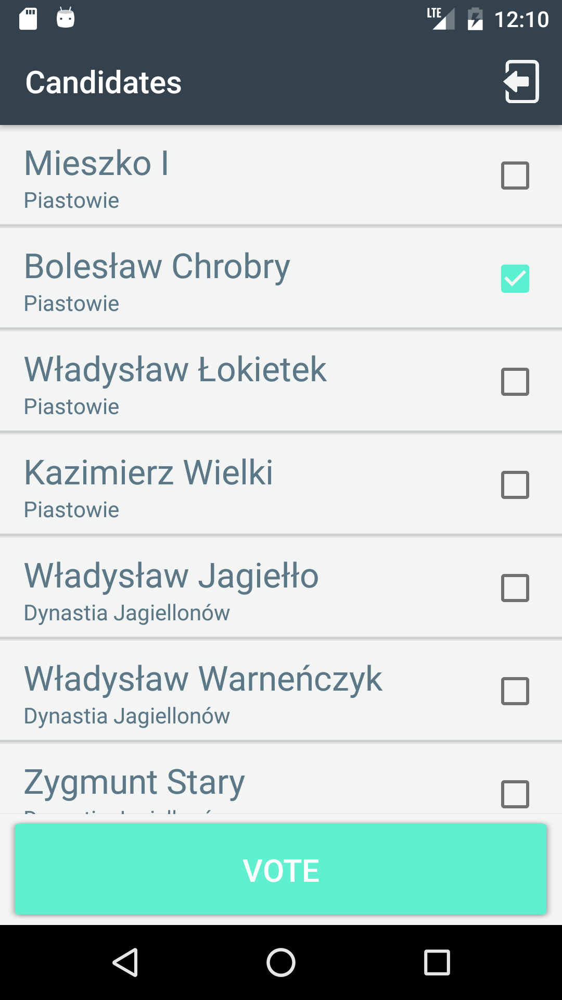
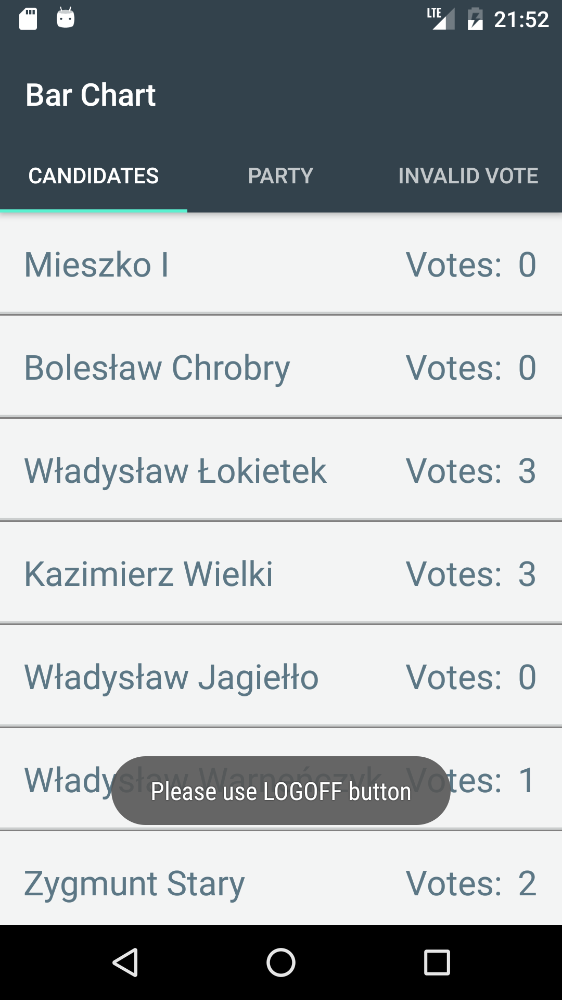
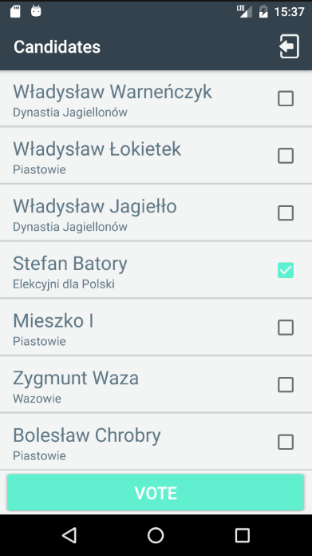

# Vote App

An android app that allows calculating the votes you cast for each candidate running for the election. The app working offline after a list candidate is downloaded.

```
* JSON from URL
* JSON Files on the device
* Shared Preferences

```

## The Login view.

<p align="center">
  
  
</p>

## The list of Candidates.

<p align="center">
  
</p>

## Summary with a bar chart.

<p align="center">


</p>
